# CG Playwright -- Main Automation Workflow

Triggered by `/cg-automate <excel-path>`. This diagram shows the complete
runtime path: Excel intake, local KB loading, live selector discovery, repair,
the write gate, and local KB write-back.

```mermaid
%%{init: {"theme": "base", "themeVariables": {"fontFamily": "Inter, Segoe UI, Arial", "fontSize": "14px", "primaryTextColor": "#172033", "lineColor": "#64748b"}}}%%
flowchart TD
    START(["/cg-automate<br/>excel.xlsx"]):::trigger

    subgraph P0["PHASE 0 - Bootstrap"]
        direction TB
        P0A["Parse Excel<br/><b>parse_excel.py</b><br/>TCs, personas, modules, steps"]:::process
        P0B["Load local KB context<br/>pages, rules, personas,<br/>flows, validations"]:::data
        P0C{"Selector map exists<br/>in kb/selectors?"}:::decision
        P0D["HYBRID mode<br/>reuse verified selectors"]:::mode
        P0E["EXPLORE mode<br/>discover selectors fresh"]:::mode
        P0F{"Module scripts<br/>already exist?"}:::decision
        P0G["CREATE mode<br/>generate module files"]:::write
        P0H{"User confirms<br/>update existing tests?"}:::decision
        P0I["UPDATE mode<br/>merge TCs and selectors<br/>never delete tests"]:::write
        P0J(["Skip module"]):::stop
        P0K["Group test cases<br/>by persona"]:::process
    end

    subgraph P1["PHASE 1 - Live Execution"]
        direction TB
        P1A["Login as persona<br/>navigate to module"]:::browser
        P1B["Execute each step<br/>actions interact<br/>validations assert"]:::browser
        P1C{"Stored selector<br/>works?"}:::decision
        P1D["CONFIRMED<br/>existing selector reused"]:::success
        P1E["Explore DOM<br/>browser_snapshot<br/>up to 3 attempts"]:::browser
        P1F["DISCOVERED + CONFIRMED<br/>new robust selector"]:::success
        P1G["Screenshot failure<br/>mark step failed<br/>continue run"]:::warning
        P1H{"Any stale or failed<br/>selectors remain?"}:::decision
        P1I["REPAIR mode<br/>re-navigate, resnapshot,<br/>try candidate selectors"]:::repair
        P1J{"All repaired?"}:::decision
        P1K["User decision<br/>skip, investigate,<br/>or manual override"]:::warning
        P1L["Write gate<br/>selector tally + file plan<br/>Proceed?"]:::gate
    end

    subgraph P2["PHASE 2 - Script Generation and Local KB Write-Back"]
        direction TB
        P2A["Page Object<br/>getters, actions,<br/>assertions"]:::write
        P2B["Spec file<br/>persona describes,<br/>beforeEach login"]:::write
        P2C["Shared source updates<br/>fixtures, constants,<br/>personas, types"]:::write
        P2D["Selector map<br/>kb/selectors/module.json<br/>confirmed only"]:::data
        P2E["Execution report<br/>kb/execution-reports/<br/>date-run.md"]:::data
        P2F["Cleanup<br/>delete parsed_tests.json"]:::process
    end

    DONE(["Complete<br/>Run /kb-sync when ready"]):::success

    START --> P0A --> P0B --> P0C
    P0C -->|Yes| P0D --> P0F
    P0C -->|No| P0E --> P0F
    P0F -->|No| P0G --> P0K
    P0F -->|Yes| P0H
    P0H -->|Yes| P0I --> P0K
    P0H -->|No| P0J

    P0K --> P1A --> P1B --> P1C
    P1C -->|Yes| P1D --> P1H
    P1C -->|No / stale| P1E
    P1E -->|Found| P1F --> P1H
    P1E -->|Not found| P1G --> P1H
    P1H -->|Yes| P1I --> P1J
    P1J -->|No| P1K --> P1L
    P1J -->|Yes| P1L
    P1H -->|No| P1L

    P1L -->|User says yes| P2A --> P2B --> P2C --> P2D --> P2E --> P2F --> DONE
    P1L -->|User says no| P1K

    classDef trigger fill:#0f172a,stroke:#0f172a,color:#ffffff,stroke-width:2px;
    classDef process fill:#e0f2fe,stroke:#0284c7,color:#0c4a6e,stroke-width:1.5px;
    classDef data fill:#ecfccb,stroke:#65a30d,color:#365314,stroke-width:1.5px;
    classDef decision fill:#fff7ed,stroke:#ea580c,color:#7c2d12,stroke-width:1.5px;
    classDef mode fill:#ede9fe,stroke:#7c3aed,color:#3b0764,stroke-width:1.5px;
    classDef browser fill:#f0fdfa,stroke:#0d9488,color:#134e4a,stroke-width:1.5px;
    classDef success fill:#dcfce7,stroke:#16a34a,color:#14532d,stroke-width:1.5px;
    classDef warning fill:#fef3c7,stroke:#d97706,color:#78350f,stroke-width:1.5px;
    classDef repair fill:#fee2e2,stroke:#dc2626,color:#7f1d1d,stroke-width:1.5px;
    classDef write fill:#fce7f3,stroke:#db2777,color:#831843,stroke-width:1.5px;
    classDef gate fill:#ffffff,stroke:#334155,color:#0f172a,stroke-width:3px;
    classDef stop fill:#f1f5f9,stroke:#64748b,color:#334155,stroke-dasharray: 5 4;
```

