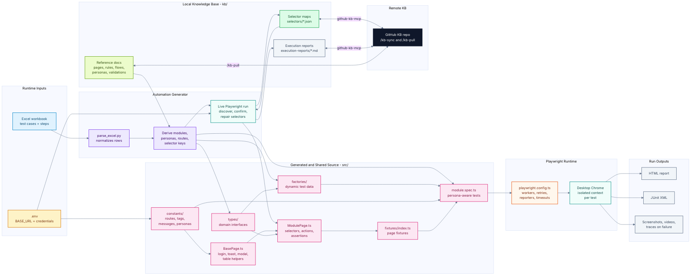

# CG Playwright -- Project Architecture

This diagram shows how Excel, local KB files, generated TypeScript, Playwright,
reports, and the remote GitHub KB fit together.

```mermaid
%%{init: {"theme": "base", "themeVariables": {"fontFamily": "Inter, Segoe UI, Arial", "fontSize": "14px", "primaryTextColor": "#172033", "lineColor": "#64748b"}}}%%
flowchart LR
    subgraph INPUT["Runtime Inputs"]
        direction TB
        XL["Excel workbook<br/>test cases + steps"]:::input
        ENV[".env<br/>BASE_URL + credentials"]:::secret
    end

    subgraph KB["Local Knowledge Base - kb/"]
        direction TB
        KBREF["Reference docs<br/>pages, rules, flows,<br/>personas, validations"]:::kb
        KBSEL["Selector maps<br/>selectors/*.json"]:::selector
        KBREP["Execution reports<br/>execution-reports/*.md"]:::report
    end

    subgraph GEN["Automation Generator"]
        direction TB
        PARSE["parse_excel.py<br/>normalizes rows"]:::tool
        DERIVE["Derive modules,<br/>personas, routes,<br/>selector keys"]:::tool
        LIVE["Live Playwright run<br/>discover, confirm,<br/>repair selectors"]:::browser
    end

    subgraph SRC["Generated and Shared Source - src/"]
        direction TB
        BASE["BasePage.ts<br/>login, toast, modal,<br/>table helpers"]:::source
        PAGE["ModulePage.ts<br/>selectors, actions,<br/>assertions"]:::source
        SPEC["module.spec.ts<br/>persona-aware tests"]:::source
        FIX["fixtures/index.ts<br/>page fixtures"]:::source
        CONST["constants/<br/>routes, tags,<br/>messages, personas"]:::source
        FACT["factories/<br/>dynamic test data"]:::source
        TYPES["types/<br/>domain interfaces"]:::source
    end

    subgraph RUN["Playwright Runtime"]
        direction TB
        CFG["playwright.config.ts<br/>workers, retries,<br/>reporters, timeouts"]:::runner
        BROWSER["Desktop Chrome<br/>isolated context<br/>per test"]:::browser
    end

    subgraph OUT["Run Outputs"]
        direction TB
        HTML["HTML report"]:::report
        JUNIT["JUnit XML"]:::report
        ART["Screenshots, videos,<br/>traces on failure"]:::report
    end

    subgraph REMOTE["Remote KB"]
        direction TB
        GH["GitHub KB repo<br/>/kb-sync and /kb-pull"]:::remote
    end

    XL --> PARSE --> DERIVE --> LIVE
    ENV --> CONST
    ENV --> LIVE
    KBREF --> DERIVE
    KBSEL --> LIVE

    LIVE --> PAGE
    DERIVE --> SPEC
    DERIVE --> FACT
    DERIVE --> TYPES
    CONST --> BASE
    BASE --> PAGE
    TYPES --> PAGE
    TYPES --> FACT
    PAGE --> FIX
    FACT --> SPEC
    CONST --> SPEC
    FIX --> SPEC

    SPEC --> CFG --> BROWSER
    BROWSER --> HTML
    BROWSER --> JUNIT
    BROWSER --> ART

    LIVE --> KBSEL
    LIVE --> KBREP
    KBSEL <-->|github-kb-mcp| GH
    KBREP <-->|github-kb-mcp| GH
    KBREF <-->|/kb-pull| GH

    classDef input fill:#e0f2fe,stroke:#0284c7,color:#0c4a6e,stroke-width:1.5px;
    classDef secret fill:#fef3c7,stroke:#d97706,color:#78350f,stroke-width:1.5px;
    classDef kb fill:#ecfccb,stroke:#65a30d,color:#365314,stroke-width:1.5px;
    classDef selector fill:#dcfce7,stroke:#16a34a,color:#14532d,stroke-width:1.5px;
    classDef report fill:#f1f5f9,stroke:#64748b,color:#334155,stroke-width:1.5px;
    classDef tool fill:#ede9fe,stroke:#7c3aed,color:#3b0764,stroke-width:1.5px;
    classDef browser fill:#f0fdfa,stroke:#0d9488,color:#134e4a,stroke-width:1.5px;
    classDef source fill:#fce7f3,stroke:#db2777,color:#831843,stroke-width:1.5px;
    classDef runner fill:#fff7ed,stroke:#ea580c,color:#7c2d12,stroke-width:1.5px;
    classDef remote fill:#0f172a,stroke:#0f172a,color:#ffffff,stroke-width:2px;
```
