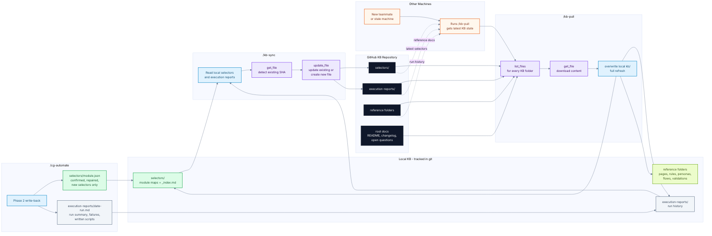

# CG Playwright -- KB Ecosystem

The local `kb/` folder is the automation memory. `/cg-automate` writes selector
maps and run reports locally; `/kb-sync` and `/kb-pull` move that knowledge
between machines through GitHub.

